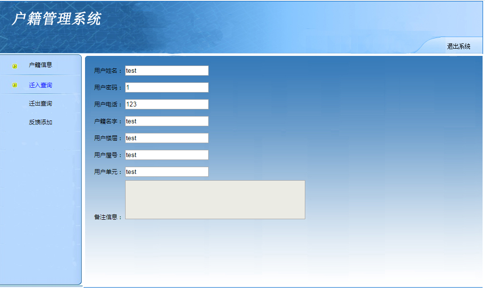

# 简单的户籍人口管理系统

> 可用于毕业设计参考或者个人学习用

- servlet+JDBC+mysql
- jsp

#### 实现功能
- [x] 该系统比较简单，主要登录退出功能  
- [x] 人口管理
- [x] 户籍管理
- [x] 迁入迁出管理
- [x] 有管理员和用户两个角色

#### 部分截图

# 源码完整版 可加qq：625285133 咨询获取，可一对一专业指定需求，个性化制定代码。
# 后续持续更新新系统，敬请期待！
